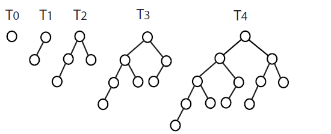
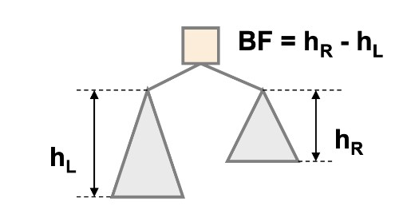
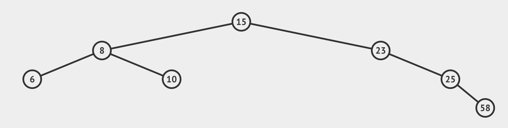
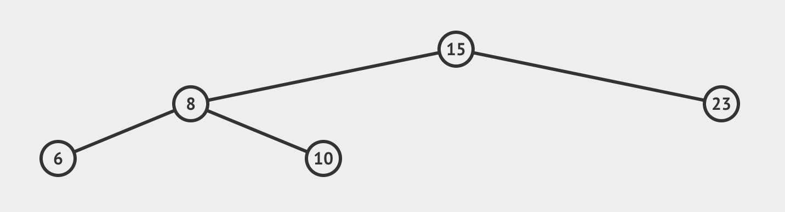

# AVL Trees

AVL trees love their heights more than anything else. Therefore, an AVL tree is a Binary Search Tree (BST) with the following properties:

1. The height has to be logarithmic **_O(log(n))_**
2. It has to satisfy the **_Height Balance Property._**
3. The subtree of an AVL Tree is itself an AVL Tree.

We count the number of edges from the root all the way to the leaf on its longest path. In an AVL tree T storing n items the tree height (h) is O(log2n).

- The height of a non existing tree is -1.
- The height of a tree T with only one node (root) is 0
- Heights of the trees above are: 0, 1, 2, 3, 4 respectively.
- The BP **(Balance Property)** has to be within the range [-1, 0, 1]
- **Unbalanced Tree:** if balance factor of any node falls outside [-1,0,1]
- **Balanced Tree:** for every node, left height & right height differ by most 1.
- **Balance Factor of leaf nodes** is 0, because the don’t have any children.

Image taken from slides by Prof. Natalija (York University)

> Running Time

- **Search:** O(logn) → BST on a Sorted Array
- **Add:** O(n) → we will need to implement Insertion Sort
- **Remove:** O(n) → even if the search is O(logn), we will still need to close the gap after deletion therefore its O(n) times.

> How do we determine if a Tree is an AVL tree?

We determine by calculating the balance factor on each node. If the the balance factor on any given node is outside the range [-1,0,1], then it is not an AVL Tree.

Let’s calculate the balance factor of each node to determine if its an AVL Tree. **_BF=height of left — height of right_**

- **Root:** BF(15)= 2–3 = -1 ✔
- **Left Subtree:** BF(6) = 0 ✔ ️ . BF(10)=0 ✔ ️ . BF(8)=1–1=0 ✔
- **Right Subtree:** BF(58)= 0 ✔ ️ . BF(25)= 1–0=1 ✔ ️ . BF(23)= 0–2 = -2 ✘

This is **NOT** an AVL Tree, as the BF at node(23) falls outside the range [-1,0,1]

What about this one? Let’s apply the same approach.

- **Root:** BF(15)= 2–1= 1✔
- **Left Subtree:** BF(6)= 0 ✔ . BF(10)= 0 ✔ . BF(8)= 1–1= 0 ✔
- **Right Subtree:** BF(23)= 0 ✔

**YESSS!** This is an AVL Tree! 🥳

> Can we convert an unbalanced tree to a balanced tree?Yes, we can! Let’s see how to do it!

**Insertion/Deletion** of a new node in your tree might destroy the balance of your tree and violate the height balance property!!! We can restore the balance through one or more “rotations”.

**Rotation:** secures the Binary Search Tree property and restores it’s balance. In order to secure a successful rotation of the tree, we can check it by performing **In-Order Traversal** and it must produce the same result on both the original tree and the reconstructed one.

**Types of Rotations**

1. **Single Left Rotation:** on a node and 2 children
2. **Single Right Rotation:** on a node and 2 children
3. **Double Left-Right Rotation:** on a node, child and grandchild.
4. **Double Right-Left Rotation:** on a node, child and grandchild.
