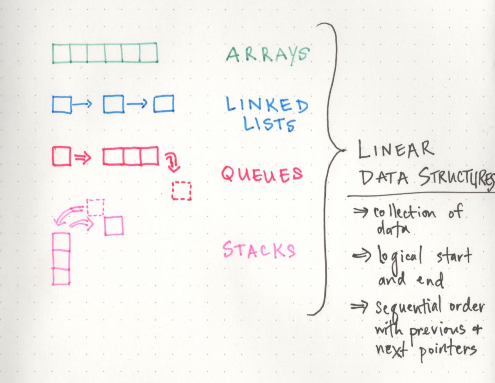
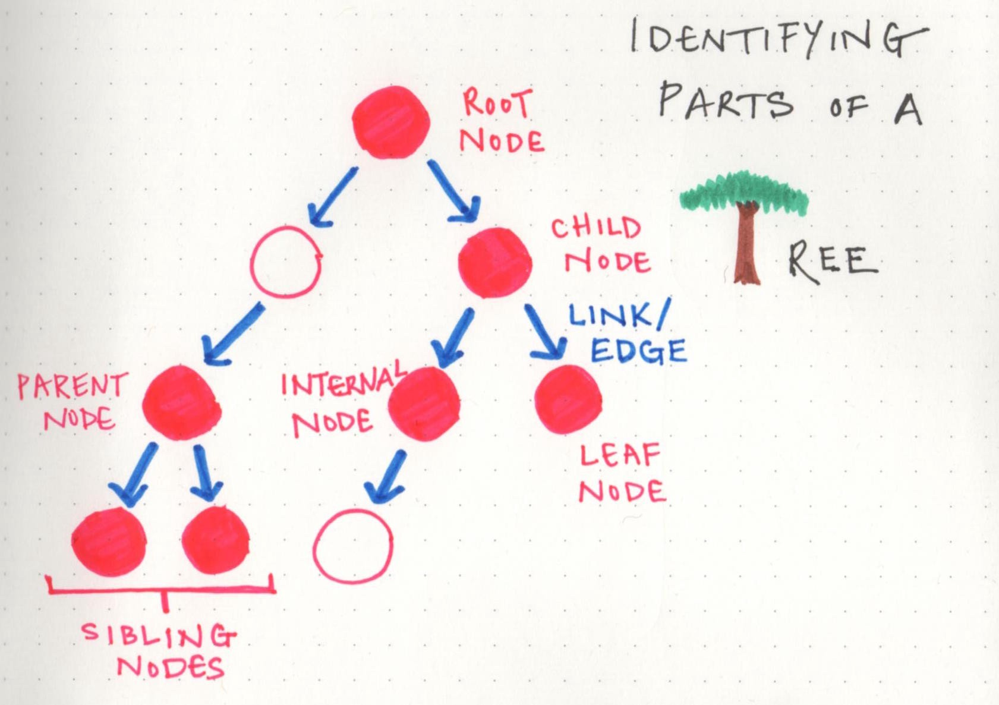
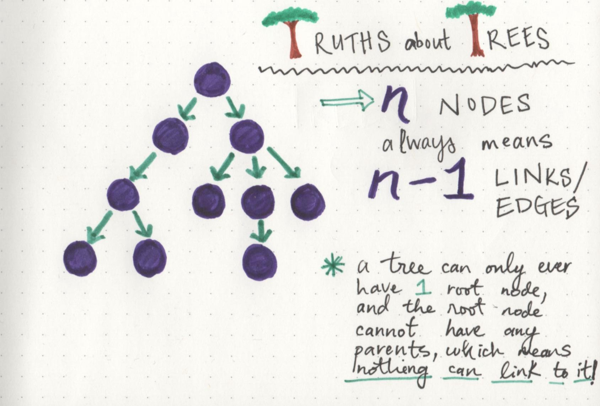
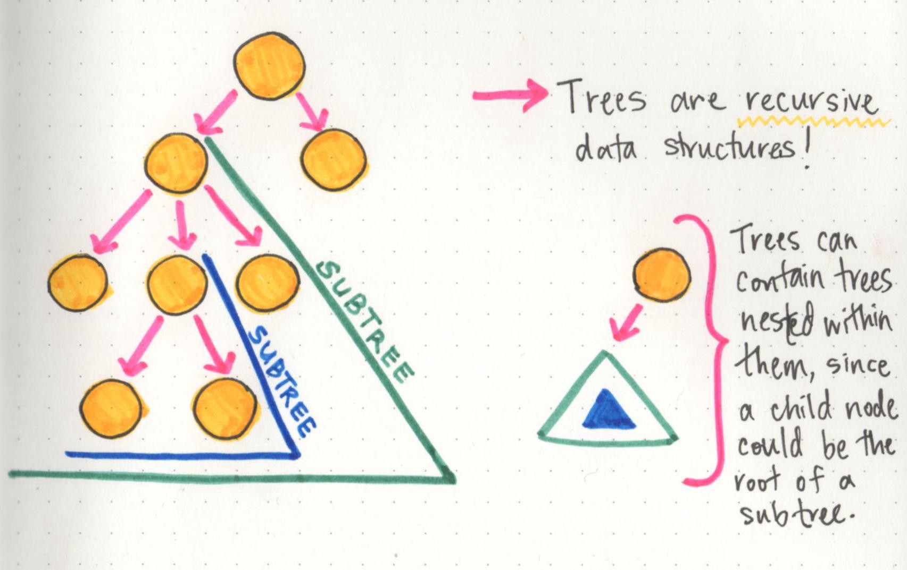
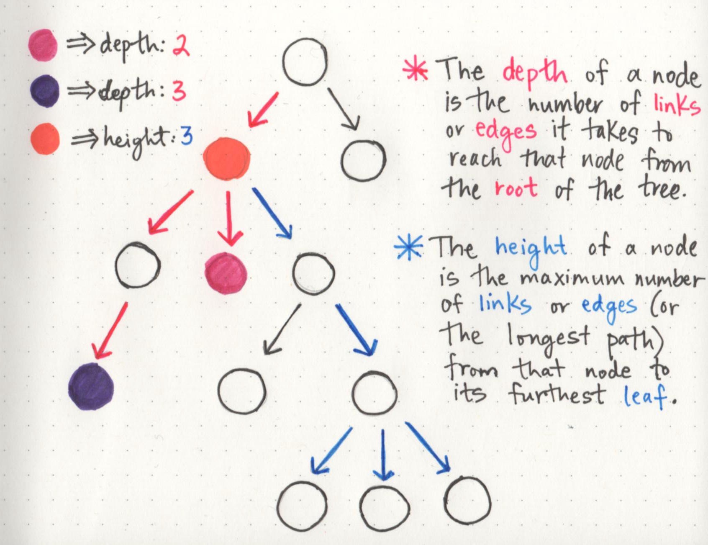
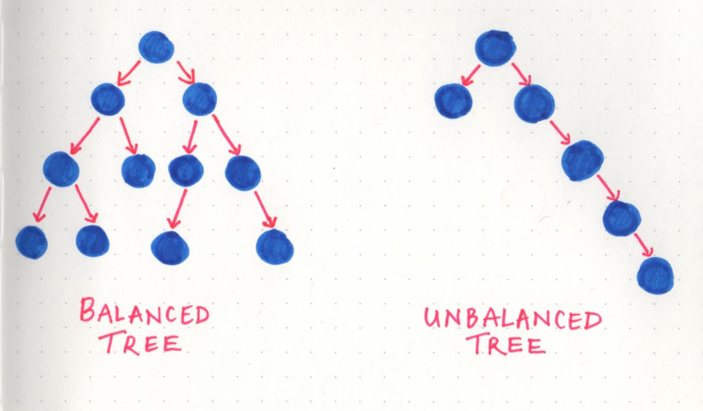
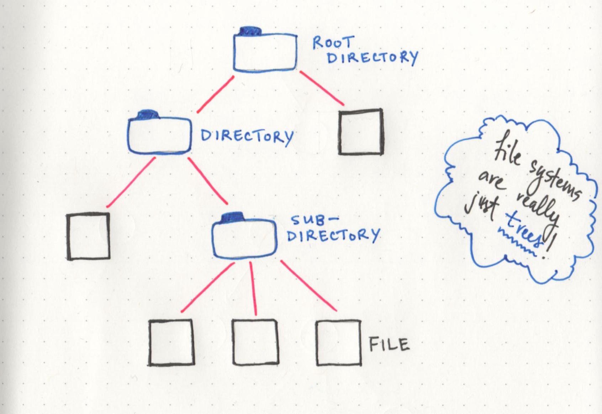

# How To Not Be Stumped By Trees. As soon as the data structure lightbulb… | by Vaidehi Joshi | basecs | Medium

Turn that tree upside down!

As soon as the data structure lightbulb goes off in your head, it’s really hard to *not* see data structures every which way that you look! Or…maybe that’s just me.

A few weeks ago, I discovered the joy of [linked lists](https://medium.com/basecs/whats-a-linked-list-anyway-part-1-d8b7e6508b9d), and the [many](https://medium.com/basecs/stacks-and-overflows-dbcf7854dc67) [different](https://medium.com/basecs/to-queue-or-not-to-queue-2653bcde5b04) abstract data types that we can build by using them! Once I realized that those simple data structures were actually under the surface of so many things that I used in my work and life every single day, I was kind of blown away. But, as it turns out, that was just the tip of the iceberg of data structures! Because *of course it is*. This is computer science, after all, where problems can be solved in so many different ways! And the same goes for data, which can be *organized* in different ways.

So far, we’ve dealt mostly with only one type of data structure. But today, we’re going to get a little crazy and shake our data out of order! That’s because we’re finally going to dive into nonlinear data structures, starting with my personal favorite: trees!

# Grow whatever kind of branches you want!

You might remember that there are lots of different ways to categorize data structures. One of the more broad categories for how we can store our data is whether our data is *linear* or not — that is to say, whether there is a sequence and an order to how our data is constructed and traversed. In **linear data structures —** such as arrays or linked lists — the data is ordered, and that order matters; the way that you traverse a linear data structure is directly related to its order, because the elements in a linear data structure can only be traversed *sequentially*.

Linear data structures in the wild

But as we now know, there are also non-linear data structures! The more that I’ve read and learned about these, the more cool they seem. But, they can also be a little tricky and unwieldily, which is why it can be really helpful to have a good handle on linear data structures first, just so that we can understand the fundamental difference between them from the get go.

In **non-linear data structures**, the data doesn’t really follow an order — at least, not an obvious numerical one, like with arrays or linked lists. And because the data doesn’t necessarily need to be arranged in a particular order, it’s easy (and actually pretty common) to traverse a non-linear data structure in a *non-sequential* manner.

One of the important types of non-linear data structures is a tree. And if we want to understand trees and how to talk about them, we need to be able to identify the parts of a tree! However, even though they look very different from the structures we’ve dealt with so far, they really are made up of the same stuff.

> Trees — like linked lists — are made up of nodes and links.

All trees, no matter if they’re oaks, maples, or ginkos, all start sprouting with a solid set of roots. In tree data structures, you also always must have a root, even if you don’t have anything else. In fact, if we had *just* a root, we’d have a single node. But, here’s where it gets interesting: a root node could have links to *multiple* other nodes. And *this right here* is the fundamental difference between the linear structures we’ve looked at so far and the trees we’re learning about now. One node can connect to many others, which means that trees can grow in different shapes and ways.

Identifying parts of a tree data structure

Here are some good terms to know when it comes to talking about trees:

- **Root**: the topmost node of the tree, which never has any links or edges connecting to it
- **Link/Edge**: the reference that a parent node contains that tells it what its child node is
- **Child**: any node that has a parent node that links to it
- **Parent**: any node that has a reference or *link* to another node
- **Sibling**: any group of nodes that are the children of the same node
- **Internal**: any node that has a child node (basically all parent nodes)
- **Leaf**: any node that does not have a child node in the tree

If these terms feel overwhelming at all, I find it helpful to think of tree data structures like a family tree, or even a corporate ladder. The data is always hierarchical. You’ll have someone (*a root node*) at the top, that delegates to some other nodes (*parent nodes*), which may or may have someone else reporting to them (*child nodes*). Or you have a huge family, with parent nodes, children nodes, all leading back up to an ancestral root node.

Just as long as you can remember that ***the data is hierarchical*** in nature, the jargon should hopefully be little less worrisome to think about.

# Speak your (tree) truth

No matter what a tree looks like, how many branches or leaves it has, or how big it grows, there are some universal “tree truths” that hold themselves to be self-evident.

I find that these are a lot easier to understand when we visualize them, so we’ll lean on some examples here. Let’s take a look at this tree we have below. It has 10 nodes in total, including the root node.

Tree truths: a tree will always have one less link than its total number of nodes

The interesting truth about this tree is that it has 10 nodes, but 9 links or edges. There’s a relationship here that holds true no matter the number of nodes, and there’s an easy rule of thumb we can remember:

> If a tree has n nodes, it will always have one less number of edges (n-1).

And if we take a look at the tree, it starts to become clear why this is. A root node is a node that can never have any parents. Therefore, it can never have anything referencing it. If every node must have one other node referencing it via a link/edge (except for the root node), then we can always be sure that our tree will have *n-1* links when *n* is the total number of nodes in the tree. How cool (and powerful!) is it that we can know that information so easily, without having to traverse the tree?!

But wait — here’s another truth that is possibly *even* cooler: trees actually contain trees within them!

Tree truths: trees are recursive data structures

Trees are **recursive data structures** because a tree is usually composed of smaller trees — often referred to as *subtrees* — inside of it. The child of one node in a tree could very well be the parent of another tree (making it the root node of a subtree). This can be really interesting when it comes to writing algorithms to traverse or search through a tree, since the nesting of trees can sometimes lead us to writing recursive search algorithms.

But we won’t get into tree traversal just yet. Instead, we’ll take a look at something that’s more important to understand first: the different ways we can classify our trees, which will come in handy down the road.

# How tall does your tree go?

Since trees can come in so many different shapes and sizes, it’s super important to be able to identify and understand what *type* of tree you’re dealing with, and what that data looks like. To that end, there are two properties that are the most important ones to talk about when it comes to what type of tree you’re dealing with, and where you data lives in that tree.

> For the most part, the two properties that we will be the most concerned with are either the depth of a node or the height of a node.

A simple way to think about the **depth** of a node is by answering the question: *how far away is the node from the root of the tree?*

But how do we know what *far* is, in this case? Well, even though we haven’t gotten into all of the complexities of tree traversal just yet, there’s only one way to traverse or search through a tree: by making a path and following the edges/links from the root node down. So, we could determine how *far* a node is from the root node by counting the number of links that it takes to reach that node from the root node.

In the example shown here, the depth of the pink node is 2, because there are exactly 2 links connecting the root node to the pink node. However, the depth of the purple node is 3, because it takes 3 links to traverse down from the root node to the purple node.

The depth and height of a node on a tree data structure

Now that we know how depth works, the second property is a little easier. The **height** of a node can be simplified by asking the question: *how far is this node from its furthest-away leaf?* (Remember: we’re turning trees upside down in the wild world of computers, which is the reason why height is determined in this way!)

So, we can find the height of a node by finding its furthest child leaf, and counting the path of links that it takes to reach it. In the example, the height of the orange node is 3, because its furthest away child leaves (there are actually three of them!) are three links away from the orange node. Bonus points if you figure out what the *depth* of the orange node is!

The cool thing about the height property in particular is that the height of the root node is automatically the height of the entire tree itself. Basically, this means that once we find the leaf node that is the furthest away from the root, we now know the longest possible path in the tree, which tells us how tall it actually is!

The reason that depth and height are so important is because they tell us a lot about what a tree looks like, right off the bat. And the thing about trees (as I’m sure by now we all know) is that they can all look different. One quick example of this is **balanced trees versus unbalanced trees**.

Balanced trees versus unbalanced trees

A tree is considered to be **balanced** if any two sibling subtrees do not differ in height by more than one level. However, if two sibling subtrees differ significantly in height (and have more than one level of depth of difference), the tree is **unbalanced**.

Balanced trees come up when we talk about tree operations, and traversal in particular. The idea behind this is that if we can traverse a tree and cut down on half of the number of operations, we’ll have a better performing data structure. However, in an unbalanced tree, this definitely is not the case, because one subtree could be significantly larger than its sibling’s subtree. A lot of the operational efficiency problems that balanced trees solve are actually called **binary trees** — but a lot more on that next week!

# Unearthing tree roots

In order to *truly* appreciate the power of a tree, we have to look at them in the context of their application. In other words: they’re probably not that cool until you see them in the wild!

One simple example lies within object oriented languages: the main `Object` is the root node, while classes that inherit from it are children of the main class. This makes more sense as you think about it; the fact that it’s often called a “class hierarchy” lends itself nicely to the hierarchal tree data structure.

The most obvious one (that maybe may not have been obvious until now!) is the file structure of a project — or even the file system on your computer! If we think about it, all the important pieces are already there: a root directory, with child nodes that could be subdirectories of their own, or leaves of the tree that end with just a simple file. All of it is really just a hierarchical tree data structure!

And to think, we had all been basking under the shade of the tree for so long and had no idea.

# Resources

If you’re a tree hugger, or a tree enthusiast, or just want to learn a little bit more, check out these helpful links!

1. [Data Structures: Introduction to Trees](https://www.youtube.com/watch?v=qH6yxkw0u78&vl=en), mycodeschool
2. [Data Structures: Trees](https://www.youtube.com/watch?v=oSWTXtMglKE), HackerRank
3. [Trees](http://www.cs.jhu.edu/~cohen/CS226/Lectures/Trees.pdf), Professor Jonathan Cohen
4. [Tree Data Structures](http://people.cs.ksu.edu/~schmidt/300s05/Lectures/Week7b.html), Professor David Schmidt
5. [Balancing Trees](http://bluehawk.monmouth.edu/rclayton/web-pages/s10-305-503/baltrees.html), Professor R. Clayton